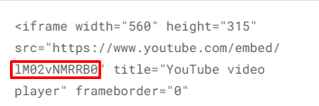
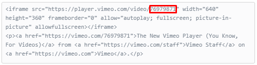

Simple embed responsive video(YouTube, Vimeo) overlay module. 

**Example**

https://codepen.io/mickyholbrook/pen/yLYvNEr

------

**Styles:**
  
  Put the required stylesheet link in HEAD tag:
  
    <link rel="stylesheet" href="./dist/css/iframe-overlay.min.css">
    
**Javascript**   
    
Put the script at the bottom of your markup: 

        
   
Or use import/require in your Javascript file:
    
    const IFrameOverlay = require('./dist/js/iframe-overlay.min.js');
    
    or
    
    import IFrameOverlay from './dist/js/iframe-overlay.min.js';
    
------    
 
**Usage**
     
Create root element, specify video ID inside "data-id" attribute. 

_Youtube video ID_

_Vimeo video ID_

          
    

 
------
         
**Initialization**

1.Specify root element (string or DOM node) in "el" option. 
 
2.Specify video hosting name("youtube" or "vimeo") in "type" option.   
*_You can pass this option in case using youtube video(option "type" has "youtube" value by default)._

3.Specify "imageSrc" if you want to overlay iframe with image.

4.Specify "iconSrc", "width" and "height" options inside "playButton" option for play button customization.  
*_You can pass "width" and "height" options (by default they are equal "10%" of their root element)_
 
      document.addEventListener('DOMContentLoaded', function() {
          new IFrameOverlay({
              el: '.video',
              type: 'youtube', //or 'vimeo'
              imageSrc: 'video-image.jpg',
              playButton: {
                  iconSrc: 'play-button.png',
                  width: '15%',
                  height: '15%',
                  percentage: 15
              }
          })
      });

------

**Options**

##### `el`
Root element for module initialization.

*Type:* String, Element  
*Required:* true

##### `type`
Points of what type of the video hosting you are going to use.

*Type:* String  
*Default:* `youtube`  
*Required:* false

##### `imageSrc`
Background image, which covers your iframe video.

*Type:* String   
*Required:* false 

##### `playButton`
Play button customization property, which includes `playButton.iconSrc`, `playButton.width`, `playButton.height` and `playButton.percentage` options.

*Type:* Object   
*Required:* true

###### `playButton.iconSrc`
Play button icon.

*Type:* String   
*Required:* true

###### `playButton.width`
Width of play button.

*Type:* String(px, %)   
*Default:* `playButton.percentage or 10% of root element`  
*Required:* false

###### `playButton.height`
Height of play button.

*Type:* String   
*Default:* `playButton.percentage or 10% of root element`  
*Required:* false

###### `playButton.percentage`
Width and height of play button in percentage. 

*Type:* Number   
*Default:* `10%`  
*Required:* false